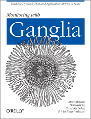

# What is Ganglia?
Ganglia is a scalable distributed monitoring system for high-performance computing systems such as clusters and Grids. It is based on a hierarchical design targeted at federations of clusters. It leverages widely used technologies such as XML for data representation, XDR for compact, portable data transport, and RRDtool for data storage and visualization. It uses carefully engineered data structures and algorithms to achieve very low per-node overheads and high concurrency. The implementation is robust, has been ported to an extensive set of operating systems and processor architectures, and is currently in use on thousands of clusters around the world. It has been used to link clusters across university campuses and around the world and can scale to handle clusters with 2000 nodes.

Ganglia is a [BSD-licensed](http://en.wikipedia.org/wiki/BSD_license) open-source project that grew out of the **University of California, Berkeley [Millennium Project](http://www.millennium.berkeley.edu/)** which was initially funded in large part by the [National Partnership for Advanced Computational Infrastructure](http://www.npaci.edu/) (NPACI) and [National Science Foundation](http://www.nsf.gov/) RI Award EIA-9802069. NPACI is funded by the [National Science Foundation](http://www.nsf.gov/) and strives to advance science by creating a ubiquitous, continuous, and pervasive national computational infrastructure: the Grid. Current support comes from [Planet Lab](http://www.planet-lab.org/): an open platform for developing, deploying, and accessing planetary-scale services.

# Download

  - [Ganglia Monitor Core](https://github.com/ganglia/monitor-core)
  - [Ganglia Web 2.0](https://github.com/ganglia/ganglia-web)
  - [gexec execution environment](TODO)
  - [python client](TODO)

# Community
  - [Github site](https://github.com/ganglia/ganglia-core)
  - [Plugin Repositories](https://github.com/ganglia) TODO 
  - [Freenode IRC channel #ganglia](irc://chat.freenode.net/ganglia) TODO

# Support
Ganglia has a large community of users you can draw on for support. This page should get you on your way to solving whatever issue you might be facing.

If you are a new user, deploying ganglia for the first time, take a [look at the ganglia Wiki page](https://github.com/ganglia/monitor-core/wiki).

You can chat with other ganglia users and developers on IRC channel #ganglia on [freenode](http://freenode.net/).

There are also a number of mailing lists which capture community knowledge dating back to 2000. All ganglia mailing lists are open for anyone to join but non-members cannot post to our lists to prevent SPAM.
  - ganglia-announce: [JOIN](http://lists.sourceforge.net/lists/listinfo/ganglia-announce) - All new ganglia releases are announced on this list.
  - ganglia-general: [JOIN](http://lists.sourceforge.net/lists/listinfo/ganglia-general) - This list is for people who use ganglia to exchange ideas, questions and comments about ganglia. [Search Archive](http://www.mail-archive.com/ganglia-general@lists.sourceforge.net/)
  - ganglia-developers: [JOIN](http://lists.sourceforge.net/lists/listinfo/ganglia-developers) - This list is for the people who develop code for ganglia to stay in sync as a team. [Search Archive](http://www.mail-archive.com/ganglia-developers@lists.sourceforge.net/)

# Contributors
he Ganglia Project was started in 2001 by Matt Massie while he was working at the University of California, Berkeley. The project has had a lot of contributors throughout the years and this is just a simple page showing appreciation to past and present contributors. If you have contributed to the project but are not listed here, please send us an email at ganglia-developers@lists.sourceforge.net or Twitter [@gangliainfo](http://twitter.com/gangliainfo).

Thank you for your contributions!

## Current Developers
  - Jesse Becker
  - Carlo Marcelo Arenas Belon
  - Nicolas Brousse
  - Kostas Georgiou
  - Bernard Li
  - Matt Massie
  - Neil McKee
  - Brad Nicholes
  - Daniel Pocock
  - Vladimir Vuksan

## Past Developers
  - Brent Chun
  - Ian Cunningham
  - Brooks Davis
  - Erich Focht
  - Mason Katz
  - Martin Knoblauch
  - Paul Millar
  - Federico Sacerdoti
  - Doc Schneider
  - Preston Smith
  - Neil T. Spring
  - Steve Wagner
  - Timothy Witham

## Contributors

  - deyemi Adesanya
  - Martin Ball
  - Ramon Bastiaans
  - Mathew Benson
  - Greg Bruno
  - Tim Cera
  - Eric Fraser
  - Mike Howard
  - Erik Kastner
  - Jeff Layton
  - Michael Perzl
  - Gilad Raphaelli
  - Jason Smith
  - Bas van der Vlies
  - Jamie Isaacs

# Book

[Buy the book today](http://shop.oreilly.com/product/0636920025573.do)

